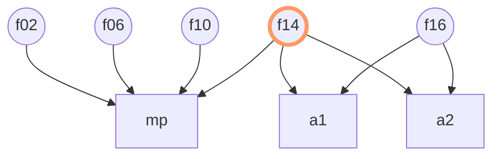

# `Follow` 语言的基本语法规则

`Follow` 语言根据 [`Metamath`](https://us.metamath.org/) 语言的启发而设计，
它是一个专门为计算机设计的数学证明语言。
`Follow` 语言基于计算机最擅长的字符串的 **替换** 和 **比较** 两个操作而设计，语法上非常简单。
也正是因为它语法上的简洁性，`Follow` 语言也成为了一个非常好的一阶数理逻辑的入门工具。

## `type` 类型

> `type <TypeName>` 

```follow 
type prop // proposition，命题，一阶逻辑的基本类型 
```

`prop` 的全称是 `proposition` ，它的中文含义是 `命题`。 它属于一阶逻辑的核心类型。命题可能是对的也可能是错的。

## `term` 类型实例

> `term <TypeName> <TermName> (<ParamList>)? { <TermString> }`
>
> `<ParamList>` = `<TypeName> <ParamName>(, <TypeName> <ParamName>)*`
>
> `<TermString>` 是符合人类阅读习惯的字符串。

```follow 
// imply，因为所以，一阶逻辑的基本连接词 
term prop imp(prop p0, prop p1) {
  (p0 → p1) // 人类便于理解的表达式
}
```

`imp` 的全称是 `imply`，它对应的抽象的数学含义是 `因为所以`。 它属于一阶逻辑的核心连接符。它隐含的抽象的真值表达式是:

| `p0` | `p1` | `imp(p0, p1)` |
| :---: | :---: | :---: | 
| F | F | T | 
| F | T | T | 
| T | F | F | 
| T | T | T |

需要强调的是，真值表达式只是人类大脑中抽象的数学概念，`Follow` 并不能理解抽象的数学概念，只知道这个字符串，它的类型是 `prop`。

## `axiom` 公理

> `axiom <AxiomName>(<ParamList>) { <Target>+ <Assumptions>* }`
>
> `<Target>` = `|- <Term>`
>
> `<Assumption>` = `-| <Term>`

在 `Follow` 眼中，公理是一些 `目标命题` 字符串 和 `条件命题` 字符串的组合。
在抽象的数学概念中，公理指的是如果 `条件命题` 是正确的，那么 `目标命题` 也是正确的。

- `目标命题` 由关键词 `|-` 开头，后面可以接多个`term`；
- `条件命题` 由关键词 `-|` 开头，后面可以接多个`term`。

如果你觉得这两个很容易记混，我这里提供一个记忆方法。

- `|-` 看起来是一个 `▷`，右边是漏斗的出口，`目标命题` 是一个 `axiom` 的输出项。 
- `-|` 看起来是一个 `◁`, 右边是漏斗的入口，`条件命题` 是一个 `axiom` 的输入项。

需要强调的是，在 `Follow` 语言中，公理可以有多个 `目标命题` 和多个 `条件命题`，并且至少有一个`目标命题`。 
`Follow` 语言建议将 `目标命题` 写在前面，`条件命题` 写在后面。
这条建议和 `Follow` 语言的证明规则的设计有关，不做强制要求。

### 一阶逻辑三条基本公理 

```follow 
// 一阶逻辑公理0 Modus Ponens
axiom mp(prop p0, prop p1) {
  |- p0
  -| p1
  -| imp(p1, p0)
}
```

```follow 
// 一阶逻辑公理1
axiom a1(prop p0, prop p1) {
  |- imp(p0,imp(p1,p0))
}
```

```follow 
// 一阶逻辑公理2
axiom a2(prop p0, prop p1, prop p2) {
  |- imp(imp(p0,imp(p1,p2)), imp(imp(p0,p1),imp(p0,p2)))
}
```

这是三条一阶逻辑的基本公理，
逻辑学家发现基于这三条公理就可以推导出所有关于 `imp` 的结论，
也就是说，这三条公理从抽象层面等价于 `imp` 的真值表。

`Follow` 语言虽然不能理解抽象的真值表，但是能够理解等价的这三条公理。
那……这等不等于 `Follow` 知道了 `imp` 抽象的真值表呢？只是一个主观的哲学问题。
讨论主观哲学问题，往往会陷入混乱的泥潭，这个教程会尽量避免这样的麻烦。

### 为什么这三条公理绑定了`imp`的真值表？

我们先罗列一下所有的输入是两个参数的bool函数，一共有16个。

| 名称 | 第一组值 | 第二组值 | 第三组值 | 第四组值 | 
| :---: | :---: | :---: | :---: | :---: |
| `p0` | 0 | 0 | 1 | 1 |
| `p1` | 0 | 1 | 0 | 1 | 
| `f01(p0,p1)` | 0 | 0 | 0 | 0 | 
| `f02(p0,p1)` | 0 | 0 | 0 | 1 | 
| `f03(p0,p1)` | 0 | 0 | 1 | 0 | 
| `f04(p0,p1)` | 0 | 0 | 1 | 1 | 
| `f05(p0,p1)` | 0 | 1 | 0 | 0 | 
| `f06(p0,p1)` | 0 | 1 | 0 | 1 | 
| `f07(p0,p1)` | 0 | 1 | 1 | 0 | 
| `f08(p0,p1)` | 0 | 1 | 1 | 1 | 
| `f09(p0,p1)` | 1 | 0 | 0 | 0 | 
| `f10(p0,p1)` | 1 | 0 | 0 | 1 | 
| `f11(p0,p1)` | 1 | 0 | 1 | 0 | 
| `f12(p0,p1)` | 1 | 0 | 1 | 1 | 
| `f13(p0,p1)` | 1 | 1 | 0 | 0 | 
| `f14(p0,p1)` | 1 | 1 | 0 | 1 | 
| `f15(p0,p1)` | 1 | 1 | 1 | 0 | 
| `f16(p0,p1)` | 1 | 1 | 1 | 1 | 

#### 公理0 `mp` 与真值表 

| 名称 | 第一组值 | 第二组值 |
| :---: | :---: | :---: |
| `p1` | 1 | 1 |
| `p0` | 0 | 1 |
| `f01(p1,p0)` | 0 | 0 | 
| `f02(p1,p0)` | 0 | 1 | 
| `f03(p1,p0)` | 1 | 0 | 
| `f04(p1,p0)` | 1 | 1 | 
| `f05(p1,p0)` | 0 | 0 | 
| `f06(p1,p0)` | 0 | 1 | 
| `f07(p1,p0)` | 1 | 0 | 
| `f08(p1,p0)` | 1 | 1 | 
| `f09(p1,p0)` | 0 | 0 | 
| `f10(p1,p0)` | 0 | 1 | 
| `f11(p1,p0)` | 1 | 0 | 
| `f12(p1,p0)` | 1 | 1 | 
| `f13(p1,p0)` | 0 | 0 | 
| `f14(p1,p0)` | 0 | 1 | 
| `f15(p1,p0)` | 1 | 0 | 
| `f16(p1,p0)` | 1 | 1 | 

公理0要求，`p1` 为真的前提下，`f(p1, p0)` 和 `p0` 等价的函数有：
`f02`, `f06`, `f10`, `f14`。

#### 公理1 `a1` 与真值表 

我们来研究一下这16个函数中，哪些满足公理一的要求呢？

| 名称 | 第一组值 | 第二组值 | 第三组值 | 第四组值 | 
| :---: | :---: | :---: | :---: | :---: |
| `p0` | 0 | 0 | 1 | 1 |
| `p1` | 0 | 1 | 0 | 1 | 
| `f01(p0,f01(p1,p0))` | 0 | 0 | 0 | 0 | 
| `f02(p0,f02(p1,p0))` | 0 | 0 | 0 | 1 | 
| `f03(p0,f03(p1,p0))` | 0 | 0 | 1 | 1 | 
| `f04(p0,f04(p1,p0))` | 0 | 0 | 1 | 1 | 
| `f05(p0,f05(p1,p0))` | 0 | 0 | 0 | 0 | 
| `f06(p0,f06(p1,p0))` | 0 | 0 | 1 | 1 | 
| `f07(p0,f07(p1,p0))` | 0 | 1 | 0 | 1 | 
| `f08(p0,f08(p1,p0))` | 0 | 1 | 1 | 1 | 
| `f09(p0,f09(p1,p0))` | 0 | 1 | 0 | 0 | 
| `f10(p0,f10(p1,p0))` | 0 | 1 | 0 | 1 | 
| `f11(p0,f11(p1,p0))` | 0 | 0 | 1 | 1 | 
| `f12(p0,f12(p1,p0))` | 0 | 0 | 1 | 1 | 
| `f13(p0,f13(p1,p0))` | 1 | 1 | 0 | 0 | 
| `f14(p0,f14(p1,p0))` | 1 | 1 | 1 | 1 | 
| `f15(p0,f15(p1,p0))` | 1 | 1 | 0 | 1 | 
| `f16(p0,f16(p1,p0))` | 1 | 1 | 1 | 1 | 

其中只有 `f14` 和 `f16` 两个函数满足 `p0->(p1->p0)` 的值恒为1，

#### 公理2 `a2` 与真值表 

| 名称 | 第一组值 | 第二组值 | 第三组值 | 第四组值 | 第五组值 | 第六组值 | 第七组值 | 第八组值 | 
| :---: | :---: | :---: | :---: | :---: | :---: | :---: | :---: | :---: |
| `p0` | 0 | 0 | 0 | 0 | 1 | 1 | 1 | 1 | 
| `p1` | 0 | 0 | 1 | 1 | 0 | 0 | 1 | 1 |
| `p2` | 0 | 1 | 0 | 1 | 0 | 1 | 0 | 1 |
| `f01(f01(p0,f01(p1,p2)),f01(f01(P0,P1),f01(p0,p2))` | 0 | 0 | 0 | 0 | 0 | 0 | 0 | 0 |
| `f02(f02(p0,f02(p1,p2)),f02(f02(P0,P1),f02(p0,p2))` | 0 | 0 | 0 | 0 | 0 | 0 | 0 | 1 |
| `f03(f03(p0,f03(p1,p2)),f03(f03(P0,P1),f03(p0,p2))` | 0 | 0 | 0 | 0 | 1 | 0 | 0 | 1 |
| `f04(f04(p0,f04(p1,p2)),f04(f04(P0,P1),f04(p0,p2))` | 0 | 0 | 0 | 0 | 1 | 1 | 1 | 1 |
| `f05(f05(p0,f05(p1,p2)),f05(f05(P0,P1),f05(p0,p2))` | 0 | 0 | 0 | 0 | 0 | 0 | 0 | 0 |
| `f06(f06(p0,f06(p1,p2)),f06(f06(P0,P1),f06(p0,p2))` | 0 | 1 | 0 | 1 | 0 | 1 | 0 | 1 |
| `f07(f07(p0,f07(p1,p2)),f07(f07(P0,P1),f07(p0,p2))` | 0 | 0 | 0 | 0 | 1 | 1 | 1 | 1 |
| `f08(f08(p0,f08(p1,p2)),f08(f08(P0,P1),f08(p0,p2))` | 0 | 1 | 1 | 1 | 1 | 1 | 1 | 1 |
| `f09(f09(p0,f09(p1,p2)),f09(f09(P0,P1),f09(p0,p2))` | 1 | 0 | 0 | 0 | 0 | 0 | 0 | 0 |
| `f10(f10(p0,f10(p1,p2)),f10(f10(P0,P1),f10(p0,p2))` | 0 | 0 | 0 | 0 | 1 | 1 | 1 | 1 |
| `f11(f11(p0,f11(p1,p2)),f11(f11(P0,P1),f11(p0,p2))` | 1 | 0 | 1 | 0 | 1 | 0 | 1 | 0 |
| `f12(f12(p0,f12(p1,p2)),f12(f12(P0,P1),f12(p0,p2))` | 0 | 1 | 1 | 0 | 1 | 1 | 1 | 1 |
| `f13(f13(p0,f13(p1,p2)),f13(f13(P0,P1),f13(p0,p2))` | 0 | 0 | 0 | 0 | 1 | 1 | 1 | 1 |
| `f14(f14(p0,f14(p1,p2)),f14(f14(P0,P1),f14(p0,p2))` | 1 | 1 | 1 | 1 | 1 | 1 | 1 | 1 |
| `f15(f15(p0,f15(p1,p2)),f15(f15(P0,P1),f15(p0,p2))` | 1 | 1 | 1 | 1 | 1 | 1 | 1 | 0 |
| `f16(f16(p0,f16(p1,p2)),f16(f16(P0,P1),f16(p0,p2))` | 1 | 1 | 1 | 1 | 1 | 1 | 1 | 1 |

其中也只有 `f14` 和 `f16` 两个函数满足 `(p0->(p1->p2))->((p0->p1)->(p0,p2))`。

#### 汇总 

| 公理 | 可行的函数（充分条件） |
| :---: | :---: |
| 公理0 `mp` | `f02`, `f06`, `f10`, `f14` | 
| 公理1 `a1` | `f14`, `f16` | 
| 公理2 `a2` | `f14`, `f16` | 



综上所述，只有函数 `f14` 是同时满 `mp`, `a1` 和 `a2` 三条公理。
关于如何从 `mp`, `a1` 和 `a2` 推导出 `f14`，需要放到后面来证明。

## `thm` 定理 

> `thm <ThmName>(<ParamList>) { <Target>+ <Assumptions>* } = {<ProofOp>+}`
>
> `<ProofOp> = AxiomOp | ThmOp` 

```follow
thm a1i(prop p0, prop p1) {
  |- imp(p0, p1)
  -| p1
} = {
}
```

`thm` 的全称是 `theorem` ，它的中文含义是 `定理`。
定理是一系列需要证明的 `term` 组合。

`Follow` 的证明语法是一个逆向的过程。
我们从剖析上面这个定理 `a1i` 的证明过程，来介绍 `Follow` 的证明语法。
`Follow` 语言的证明语法只涉及字符串的比较和字符串的替换操作，非常简单。

- 第一步是起始阶段，我们需要证明 `imp(p0,p1)`。
- 第二步是输入 `mp(imp(p0,p1),p1)`。经过对字符串的**替换**操作，
  它会产生这样一个 `term` 组合 `|- imp(p0,p1) -| imp(p1,imp(p0,p1)) -| p1`；
  `Follow` 通过对字符串的**比较**发现，组合中的`imp(p0,p1)`正是第一步中我们要证明的结论，
  所以它就会知道，我们不需要再证明 `imp(p0,p1)`，
  而是要证明另外两个 `term`：`imp(p1,imp(p0,p1))` 和 `p1`。
  接着，`Follow` **比较**发现 `p1` 已经在 `a1i` 的条件中，不需要再证明。
  所以它会知道，经过第二步后，我们只需要再证明 `imp(p1,imp(p0,p1))`。
- 第三步是输入 `a1(p1,p0)`。经过对字符串的**替换**操作，
  它会产生这样一个 `term` `|- imp(p1,imp(p0,p1))`。
  `Follow`通过对字符串的**比较**操作，发现这正是我们需要证明的结论。
  因为第三步并没有条件，也就没有新的需要证明的 `term`。
- 由于没有新的需要证明的`term`，因此`Follow`也就判定定理 `a1i` 被证明。

我们回顾一下这个证明过程，我们不断地输入前面的公理或者定理，将需要证明的目标转化为新的目标。因为证明过程是从目标命题转化到条件命题，所以声明公理和定理的时候，建议将目标命题写在前面，条件命题写在后面，和证明过程保持一致。

# 总结

这一小结介绍了`Follow`语言的基本语法，同时声明了一阶逻辑的三个公理和一个定理。