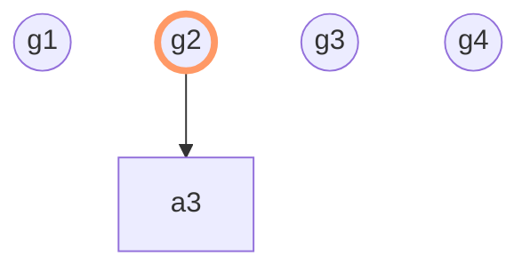

# 逻辑连接符 `not` 

`not` 是一阶逻辑的第二个核心连接符，它和 `imp` 合起来能够表达所有的逻辑关系。

```follow
term prop not(prop p0) { (¬ p0) }
```

```follow
// 一阶逻辑公理3 
axiom a3(prop p0, prop p1) {
  |- imp(imp(not(p0),not(p1)),imp(p1,p0))
}
```

## `not` 与真值表 

我们来研究一下什么样的函数能够满足公理3。

| 名称 | 第一组值 | 第二组值 |
| :---: | :---: | :---: |
| `p0` | 0 | 1 |
| `g1(p0)` | 0 | 0 |
| `g2(p0)` | 1 | 0 |
| `g3(p0)` | 0 | 1 |
| `g4(p0)` | 1 | 1 |

| 名称 | 第一组值 | 第二组值 | 第三组值 | 第四组值 | 
| :---: | :---: | :---: | :---: | :---: |
| `p0` | 0 | 0 | 1 | 1 |
| `p1` | 0 | 1 | 0 | 1 | 
| `(g1(p0)→g1(p1))→(p1→p0)` | 1 | 0 | 1 | 1 | 
| `(g2(p0)→g2(p1))→(p1→p0)` | 1 | 1 | 1 | 1 | 
| `(g3(p0)→g3(p1))→(p1→p0)` | 1 | 0 | 1 | 1 |
| `(g4(p0)→g4(p1))→(p1→p0)` | 1 | 0 | 1 | 1 | 



## 简单定理 

```follow
thm a3i(prop p0, prop p1) {
  |- imp(p0, p1)
  -| imp(not(p1),not(p0))
} = {
  mp(imp(p0,p1), imp(not(p1),not(p0)))
  a3(p1, p0)
}
```

```follow
thm a3id(prop p0, prop p1, prop p2) {
  |- imp(p0, imp(p1, p2))
  -| imp(p0, imp(not(p2),not(p1)))
} = {
  syl(p0, imp(p1,p2), imp(not(p2),not(p1)))
  a3(p2, p1)
}
```

## 反证法 `Contradiction` 

反证法的形式有很多种。这个教程把归谬法和反证法等非常相近的定理都叫做反证法，统一用 `cont` 开头，方便后面的使用。(想要使用反证法，只需要输入 `cont.`，vscode中的follow语言的插件会同时尝试匹配所有 `cont.` 开头的定理，非常方便。)

```follow
thm cont.1(prop p0, prop p1) {
  |- imp(not(p0),imp(p0, p1))
  |- imp(p0, imp(not(p0),p1))
} = {
  com12i(p0, not(p0), p1)
  syl(not(p0), imp(p0,p1), imp(not(p1),not(p0)))
  a3(p1, p0)
  a1(not(p0), not(p1))
}
```

```follow
thm cont.2(prop p0) {
  |- imp(imp(not(p0),p0), p0)
} = {
  iid(imp(not(p0),p0), p0)
  a3id(imp(not(p0),p0), imp(not(p0),p0), p0)
  a2i(not(p0), p0, not(imp(not(p0),p0)))
  cont.1(p0, not(imp(not(p0),p0)))
}
```

```follow
thm notnot.1(prop p0) {
  |- imp(not(not(p0)), p0)
} = {
  iid(not(not(p0)), p0)
  a3id(not(not(p0)), not(not(p0)), p0)
  cont.1(not(p0), not(not(not(p0))))
}
```

```follow
thm notnot.2(prop p0) {
  |- imp(p0, not(not(p0)))
} = {
  a3i(p0, not(not(p0)))
  notnot.1(not(p0))
}
  
```

```follow
thm cont.3(prop p0) {
  |- imp(imp(p0, not(p0)), not(p0))
} = {
  syl(imp(p0,not(p0)), not(p0), imp(not(not(p0)),not(p0)))
  cont.2(not(p0))
  transi.2(not(not(p0)), p0, not(p0))
  notnot.1(p0)
}
```

## 逆否命题 `contraposition` 

```follow
thm con.1(prop p0, prop p1) {
  |- imp(imp(not(p0), p1), imp(not(p1), p0))
} = {
  a3id(imp(not(p0),p1), not(p1), p0)
  transi.1(not(p0), p1, not(not(p1)))
  notnot.2(p1)
}
```

```follow
thm con.2(prop p0, prop p1) {
  |- imp(imp(p0, not(p1)), imp(p1, not(p0)))
} = {
  a3id(imp(p0,not(p1)), p1, not(p0))
  transi.2(not(not(p0)), p0, not(p1))
  notnot.1(p0)
}
```

```follow
thm con.3(prop p0, prop p1) {
  |- imp(imp(not(p0),not(p1)), imp(p1, p0))
} = {
  a3(p0, p1)
}
```

```follow
thm con.4(prop p0, prop p1) {
  |- imp(imp(p0,p1),imp(not(p1),not(p0)))
} = {
  syl(imp(p0,p1), imp(not(p1),not(p0)), imp(p0,not(not(p1))))
  con.2(p0, not(p1))
  transi.1(p0, p1, not(not(p1)))
  notnot.2(p1)
}
```

### Induction

```follow
thm coni.1(prop p0, prop p1) {
  |- imp(not(p0), p1)
  -| imp(not(p1), p0)
} = {
  mp(imp(not(p0),p1), imp(not(p1),p0))
  con.1(p1, p0)
}
```

```follow
thm coni.2(prop p0, prop p1) {
  |- imp(p0, not(p1))
  -| imp(p1, not(p0))
} = {
  mp(imp(p0,not(p1)), imp(p1,not(p0)))
  con.2(p1, p0)
}
```

```follow
thm coni.3(prop p0, prop p1) {
  |- imp(p0, p1)
  -| imp(not(p1),not(p0))
} = {
  mp(imp(p0,p1), imp(not(p1),not(p0)))
  con.3(p1, p0)
}
```

```follow
thm coni.4(prop p0, prop p1) {
  |- imp(not(p0),not(p1))
  -| imp(p1,p0)
} = {
  mp(imp(not(p0),not(p1)), imp(p1,p0))
  con.4(p1, p0)
}
```

### Deduction

```follow
thm conid.1(prop p0, prop p1, prop p2) {
  |- imp(p0, imp(not(p1), p2))
  -| imp(p0, imp(not(p2), p1))
} = {
  syl(p0, imp(not(p1),p2), imp(not(p2),p1))
  con.1(p2, p1)
}
```

```follow
thm conid.2(prop p0, prop p1, prop p2) {
  |- imp(p0, imp(p1, not(p2)))
  -| imp(p0, imp(p2 not(p1)))
} = {
  syl(p0, imp(p1,not(p2)), imp(p2,not(p1)))
  con.2(p2, p1)
}
```

```follow
thm conid.3(prop p0, prop p1, prop p2) {
  |- imp(p0, imp(p1, p2))
  -| imp(p0, imp(not(p2),not(p1)))
} = {
  syl(p0, imp(p1,p2), imp(not(p2),not(p1)))
  con.3(p2, p1)
}
```

```follow
thm conid.4(prop p0, prop p1, prop p2) {
  |- imp(p0, imp(not(p1),not(p2)))
  -| imp(p0, imp(p2,p1))
} = {
  syl(p0, imp(not(p1),not(p2)), imp(p2,p1))
  con.4(p2, p1)
}
```

## 反证法 `Contradiction` (续)

```follow
thm cont.4(prop p0, prop p1) {
  |- imp(imp(p0,p1), imp(imp(not(p0),p1), p1))
  |- imp(imp(not(p0),p1), imp(imp(p0,p1), p1))
} = {
  com12i(imp(not(p0),p1), imp(p0,p1), p1)
  rw2(imp(p0,p1), imp(not(p0),p1), p1, imp(not(p1),p0))
  con.1(p0, p1)
  rw3(imp(p0,p1), imp(not(p1),p0), p1, imp(not(p1),p1))
  trans.1(not(p1), p0, p1)
  cont.2(p1)
}
```

```follow
thm cont.5(prop p0, prop p1) {
  |- imp(imp(p0,p1), imp(imp(p0,not(p1)), not(p0)))
  |- imp(imp(p0,not(p1)), imp(imp(p0,p1), not(p0)))
} = {
  com12i(imp(p0,not(p1)), imp(p0,p1), not(p0))
  rw2(imp(p0,p1), imp(p0,not(p1)), not(p0), imp(p1,not(p0)))
  con.2(p0, p1)
  rw3(imp(p0,p1), imp(p1,not(p0)), not(p0), imp(p0,not(p0)))
  trans.2(p0, p1, not(p0))
  cont.3(p0)
}
```

```follow
thm cont.6(prop p0, prop p1) {
  |- imp(imp(not(p0),p1), imp(imp(not(p0),not(p1)), p0))
  |- imp(imp(not(p0),not(p1)), imp(imp(not(p0),p1), p0))
} = {
  com12i(imp(not(p0),not(p1)), imp(not(p0),p1), p0)
  rw3(imp(not(p0),p1), imp(not(p0),not(p1)), p0, not(not(p0)))
  cont.5(not(p0), p1)
  notnot.1(p0)
}
```

### 反证法汇总 

| 名称 | 目标命题 |
| :---: | :---: |
| `cont.1` | `((¬p0)→(p0→p1))` <br> `(p0→((¬p0)→p1))` |
| `cont.2` | `(((¬p0)→p0)→p0)` |
| `cont.3` | `((p0→(¬p0))→(¬p0))` | 
| `cont.4` | `((p0→p1)→(((¬p0)→p1)→p1))` <br> `(((¬p0)→p1)→((p0→p1)→p1))` |
| `cont.5` | `((p0→p1)→((p0→(¬p1))→(¬p0)))` <br> `((p0→(¬p1))→((p0→p1)→(¬p0)))` | 
| `cont.6` | `(((¬p0)→p1)→(((¬p0)→(¬p1))→p0))` <br> `(((¬p0)→(¬p1))→(((¬p0)→p1)→p0))` | 

### Induction

```follow
thm conti.1.1(prop p0, prop p1) {
  |- imp(p0, p1)
  -| not(p0)
} = {
  mp(imp(p0,p1), not(p0))
  cont.1(p0, p1)
}
```

```follow
thm conti.1.2(prop p0, prop p1) {
  |- imp(not(p0), p1)
  -| p0
} = {
  mp(imp(not(p0),p1), p0)
  cont.1(p0, p1)
}
```

```follow
thm contii.1(prop p0, prop p1) {
  |- p0
  -| p1
  -| not(p1)
} = {
  mp(p0, p1)
  mp(imp(p1,p0), not(p1))
  cont.1(p1, p0)
}
```

```follow
thm conti.2(prop p0) {
  |- p0
  -| imp(not(p0),p0)
} = {
  mp(p0, imp(not(p0),p0))
  cont.2(p0)
}
```

```follow
thm conti.3(prop p0) {
  |- not(p0)
  -| imp(p0, not(p0))
} = {
  mp(not(p0), imp(p0,not(p0)))
  cont.3(p0)
}
```

```follow
thm contii.4(prop p0, prop p1) {
  |- p0
  -| imp(p1,p0)
  -| imp(not(p1),p0)
} = {
  mp(p0, imp(p1,p0))
  mp(imp(imp(p1,p0),p0), imp(not(p1),p0))
  cont.4(p1, p0)
}
```

```follow
thm contii.5(prop p0, prop p1) {
  |- not(p0)
  -| imp(p0, p1)
  -| imp(p0,not(p1))
} = {
  mp(not(p0), imp(p0,p1))
  mp(imp(imp(p0,p1),not(p0)), imp(p0,not(p1)))
  cont.5(p0, p1)
}
```

```follow
thm contii.6(prop p0, prop p1) {
  |- p0
  -| imp(not(p0),not(p1))
  -| imp(not(p0),p1)
} = {
  mp(p0, imp(not(p0),not(p1)))
  mp(imp(imp(not(p0),not(p1)),p0), imp(not(p0),p1))
  cont.6(p0, p1)
}
```

### Deduction 

```follow
thm contid.1.1(prop p0, prop p1, prop p2) {
  |- imp(p0, imp(p1, p2))
  -| imp(p0, not(p1))
} = {
  syl(p0, imp(p1,p2), not(p1))
  cont.1(p1, p2)
}
```

```follow
thm contid.1.2(prop p0, prop p1, prop p2) {
  |- imp(p0, imp(not(p1), p2))
  -| imp(p0, p1)
} = {
  syl(p0, imp(not(p1),p2), p1)
  cont.1(p1, p2)
}
```

```follow
thm contiid.1(prop p0, prop p1, prop p2) {
  |- imp(p0, p1)
  -| imp(p0, p2)
  -| imp(p0, not(p2))
} = {
  mpd(p0, p1, p2)
  syl(p0, imp(p2,p1), not(p2))
  cont.1(p2, p1)
}
```

```follow
thm contid.2(prop p0, prop p1) {
  |- imp(p0, p1)
  -| imp(p0, imp(not(p1),p1))
} = {
  syl(p0, p1, imp(not(p1),p1))
  cont.2(p1)
}
```

```follow
thm contid.3(prop p0, prop p1) {
  |- imp(p0, not(p1))
  -| imp(p0, imp(p1, not(p1)))
} = {
  syl(p0, not(p1), imp(p1,not(p1)))
  cont.3(p1)
}
```

```follow
thm contiid.4(prop p0, prop p1, prop p2) {
  |- imp(p0,p1)
  -| imp(p0, imp(p2,p1))
  -| imp(p0, imp(not(p2),p1))
} = {
  mpd(p0, p1, imp(p2,p1))
  syl(p0, imp(imp(p2,p1),p1), imp(not(p2),p1))
  cont.4(p2, p1)
}
```

```follow
thm contiid.5(prop p0, prop p1, prop p2) {
  |- imp(p0, not(p1))
  -| imp(p0, imp(p1, p2))
  -| imp(p0, imp(p1,not(p2)))
} = {
  mpd(p0, not(p1), imp(p1,p2))
  syl(p0, imp(imp(p1,p2),not(p1)), imp(p1,not(p2)))
  cont.5(p1, p2)
}
```

```follow
thm contiid.6(prop p0, prop p1, prop p2) {
  |- imp(p0,p1)
  -| imp(p0, imp(not(p1),not(p2)))
  -| imp(p0, imp(not(p1),p2))
} = {
  mpd(p0, p1, imp(not(p1),not(p2)))
  syl(p0, imp(imp(not(p1),not(p2)),p1), imp(not(p1),p2))
  cont.6(p1, p2)
}
```

## Join

```follow
thm join(prop p0, prop p1, prop p2) {
  |- imp(imp(not(p0),p2), imp(imp(p1,p2), imp(imp(p0,p1),p2)))
  |- imp(imp(p1,p2), imp(imp(not(p0),p2), imp(imp(p0,p1),p2)))
} = {
  com12i(imp(p1,p2), imp(not(p0),p2), imp(imp(p0,p1),p2))
  rw2(imp(not(p0),p2), imp(p1,p2), imp(imp(p0,p1),p2), imp(not(p2),not(p1)))
  con.4(p1, p2)
  rw3(imp(not(p0),p2), imp(not(p2),not(p1)), imp(imp(p0,p1),p2), imp(not(p2),not(imp(p0,p1))))
  con.3(p2, imp(p0,p1))
  a2id(imp(not(p0),p2), not(p2), not(p1), not(imp(p0,p1)))
  syl(imp(not(p0),p2), imp(not(p2),imp(not(p1),not(imp(p0,p1)))), imp(not(p2),p0))
  con.1(p0, p2)
  mp(imp(imp(not(p2),p0),imp(not(p2),imp(not(p1),not(imp(p0,p1))))), imp(p0,imp(not(p1),not(imp(p0,p1)))))
  trans.1(not(p2), p0, imp(not(p1),not(imp(p0,p1))))
  conid.4(p0, p1, imp(p0,p1))
  iidd(p0, p1)
}
```

```follow
thm joinii(prop p0, prop p1, prop p2) {
  |- imp(imp(p0,p1),p2)
  -| imp(not(p0),p2)
  -| imp(p1,p2)
} = {
  mp(imp(imp(p0,p1),p2), imp(not(p0),p2))
  mp(imp(imp(not(p0),p2),imp(imp(p0,p1),p2)), imp(p1,p2))
  join(p0, p1, p2)
}
```

```follow
thm joiniid(prop p0, prop p1, prop p2, prop p3) {
  |- imp(p0, imp(imp(p1,p2),p3))
  -| imp(p0, imp(not(p1),p3))
  -| imp(p0, imp(p2,p3))
} = {
  mpd(p0, imp(imp(p1,p2),p3), imp(not(p1),p3))
  syl(p0, imp(imp(not(p1),p3),imp(imp(p1,p2),p3)), imp(p2,p3))
  join(p1, p2, p3)
}
```

